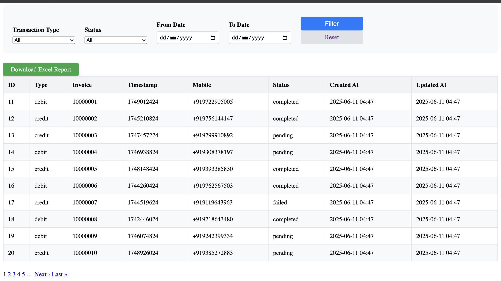

## Transaction History Management System

### Overview
This Rails application maintains a database of transaction histories and provides option to generate Excel reports and list transactions with pagination and filtering.

### Database
Database Engine: MySQL

Fields:

id (auto-increment/primary key)

type (string: credit or debit)

invoice (string, 8-digit, unique)

timestamp (integer, Unix timestamp)

mobile (string)

status (string)

created_at and updated_at (Rails timestamps)

### Features
Transaction Record Management: Retrieve transaction records with pagination and filtering by date and/or type. You can download the filtered/unfiltered report from Transactions list page or by accessing the reports.xlsx endpoint.

Excel Report Generation: Download a report with two sheets:

Summary: Aggregated data (e.g., totals, counts by type/status)

Dump: Complete list of transactions

### Endpoints
List transactions UI: GET /transactions

List transaction JSON: GET /transactions.json

Download report: GET /transactions/report.xlsx